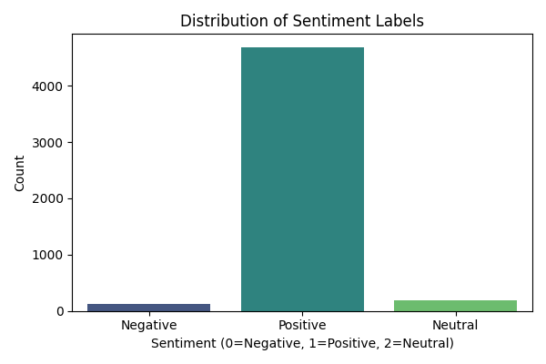

#  Sentiment Analysis using Machine Learning

This project performs **Sentiment Analysis** on user reviews using Machine Learning and Natural Language Processing (NLP) techniques. The goal is to classify reviews into positive, negative, or neutral categories based on the textual content.

---

##  Table of Contents
- [About the Project](#about-the-project)
- [Dataset](#dataset)
- [Project Structure](#project-structure)
- [Technologies Used](#technologies-used)
- [Models Implemented](#models-implemented)
- [How to Run](#how-to-run)
- [Results](#results)
- [Screenshots](#screenshots)
- [License](#license)

---

##  About the Project

Sentiment analysis is a text classification technique that analyzes the polarity of textual data—positive, negative, or neutral. This project:
- Loads and cleans user review text data
- Converts text into numerical features
- Trains multiple machine learning models
- Evaluates and compares model performance

---

##  Dataset

- **Name**: [Amazon Product Reviews](https://www.kaggle.com/datasets/datafiniti/consumer-reviews-of-amazon-products)
- **Description**: Contains 10,000+ product reviews from Amazon with ratings from 1 to 5 stars.
- **Format**: CSV

---

##  Project Structure

```
Sentiment-Analysis/
├── data/                                        # Raw/processed datasets
├── images/                                      # Output plots, wordclouds
├── models/                                      # Trained model files (if saved)
├── notebooks/
│   └── Sentiment_Analysis_amazon_reviews.ipynb  # Main Jupyter notebook
├── README.md                                    # Project overview
├── requirements.txt                             # Dependencies list
└── .gitignore                                   # Files to ignore in git
```

---

##  Technologies Used

- **Python 3.x**
- **Libraries**:
  - pandas, numpy
  - matplotlib, seaborn
  - scikit-learn
  - nltk / spaCy
  - wordcloud

---

##  Models Implemented

- Logistic Regression
- Naive Bayes
- Support Vector Machine (SVM)
- Random Forest

---

##  How to Run

1. **Clone the repository**
   ```bash
   git clone https://github.com/Sreelatha09/Sentiment-Analysis.git
   cd Sentiment-Analysis
   ```

2. **Install dependencies**
   ```bash
   pip install -r requirements.txt
   ```

3. **Launch the notebook**
   ```bash
   jupyter notebook notebooks/Sentiment_Analysis_amazon_reviews.ipynb
   ```

---

##  Results

- **Best Model**: Random Forest algorithm  with 95% accuracy 
- Wordclouds and charts show key sentiment-driving words
- Evaluation: Confusion Matrix, Accuracy, Precision, Recall, F1 Score,Support

---

##  Screenshots

| sentiment - Distribution | Top Tf-idf Words |
|-----------------------------|------------------------------|
|  |  |

| Model Accuracy Comparison |
|---------------------------|
|  |

---

##  License

This project is licensed under the [MIT License](LICENSE).

---

##  Acknowledgements

- Kaggle for dataset
- Open-source contributors for tools and libraries used in this project

---

⭐️ *Star this repository if you like the project or want to support it!*
